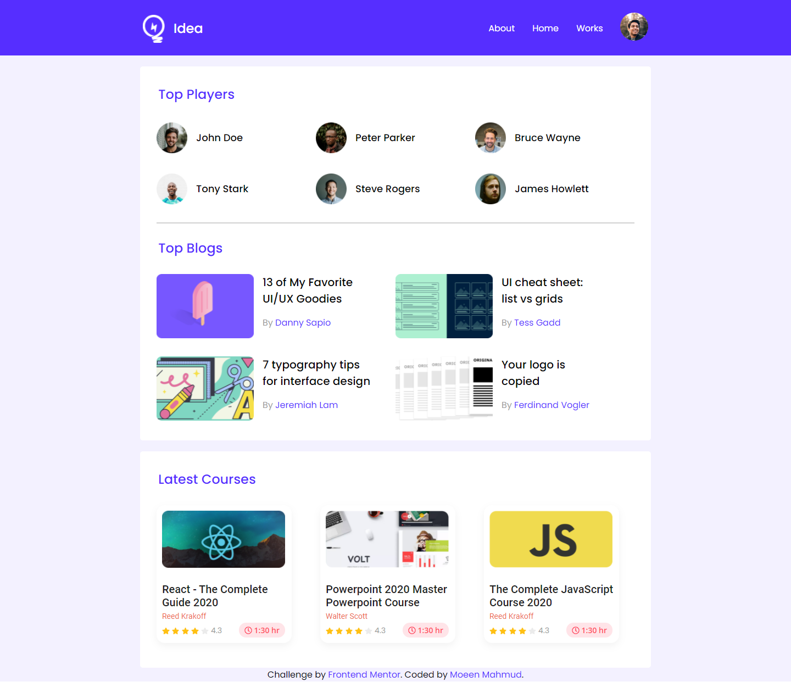

# Programming Hero - Leader Board Landing Page Solution

This is a solution to the [Leader Board Landing Page challenge on Programming Hero](https://github.com/ProgrammingHero1/leader-board). Programming Hero is a great frontend web development bootcamp for those who have the passion for learning and coding. It helps you improve your coding skills by buiding realistic projects.

## Table of contents

- [Overview](#overview)
  - [The challenge](#the-challenge)
  - [Screenshot](#screenshot)
  - [Links](#links)
- [My process](#my-process)
  - [Built with](#built-with)
  - [What I learned](#what-i-learned)
  - [Continued development](#continued-development)
  - [Useful resources](#useful-resources)
- [Author](#author)

## Overview

### The challenge

Users should be able to view the optimal layout depending on their device's screen size

### Screenshot

### Links

- Solution URL: [Git Repo](https://github.com/moeen-mahmud/leader-board)
- Live Site URL: [Live Site](https://exercise-leader-board.vercel.app/)

## My Process

### Built With

- HTML5 markup
- CSS custom properties
- Flexbox
- Mobile-first workflow
- [GoogleFonts](https://fonts.google.com/) - For font styles
- [Font Awesome](https://fontawesome.com/) - For icons

### What I learned

This challenge seems to be easy but the layout positioning is little tricky. I struggled a bit to organize the cards. Though it is not pixel perfect but relatively same to the original. This is a great challenge and I enjoy a lot.

### Continued Development

I really enjoy the course and the coding challenges. I will do at least one landing page per day from now on.

### Useful resources

- [Conquering Responsive Layouts](https://courses.kevinpowell.co/) - [Kevin](https://twitter.com/KevinJPowell) is one of my favourite instructor and I learned a lot of CSS **Techniques** from him.
- [MDN](https://developer.mozilla.org/en-US/) - There is nothing new to say about this resource.

## Author

- Frontend Mentor - [fahim-mahmud](https://www.frontendmentor.io/profile/fahim-mahmud)
- Twitter - [moeen_mahmud](https://twitter.com/moeen_mahmud)
